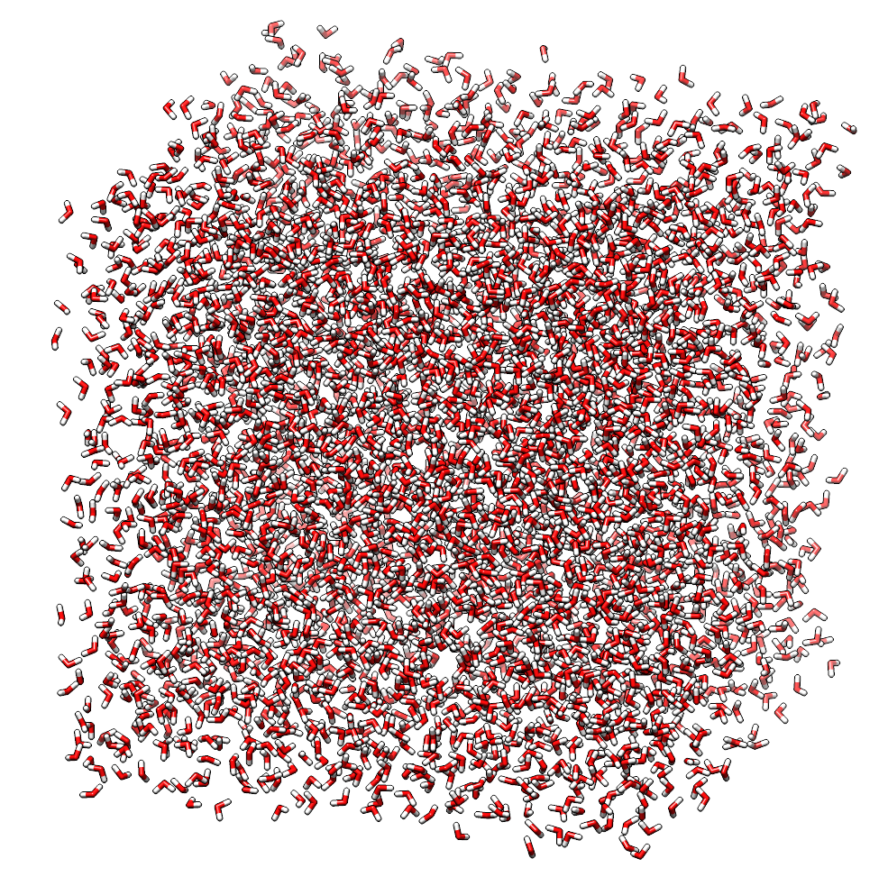

# Simulating Water with Molecular Dynamics

This repository contains a basic simulation of water with Molecular Dynamics using [GROMACS](https://www.gromacs.org/) (GROningen MAchine for Chemical Simulations). This is an assignment to evaluate a Ph.D. candidate's starting skills and knowledge. A basic report is included in the *report* directory.

<p align="center">
 </br>
<em>Representation of the Simulation Cell</em>
</p>

## Environment and Python Setup

The present code was developed using the following system. It is recommended to use a similar setup to avoid any issues:

* Ubuntu 23.04
* Python 3.11.2
* GROMACS 2023.1

To replicate the Python setup, create a new environment using venv and install the packages in the *requirements.txt* file.

```bash
python3 -m venv venv
source env/bin/activate
pip install -r requirements.txt
```

## Running the code

To run the main simulations, *cd* into the *sims* directory and run the corresponding files for each step.

```bash
cd sims
./init.sh   # runs the initialization of the system
./emin.sh   # runs the energy minimization
./equi.sh   # runs the equilibration
./prod.sh   # runs the production
```

## Running the benchmarks

To run the benchmarks, *cd* into the *benchmarks* directory and run the python file that automates the process.

```bash
cd benchmarks
python3 benchmarks.py
```

## Generating the plots

To generate the plots, *cd* into the *plots* directory and run the python file for the corresponding plot. This will only work if the simulations and/or benchmarks have been previously run.

```bash
cd plots
python3 bench.py  # generates the benchmarks plot
python3 emin.py   # generates the energy minimization plot
python3 equi.py   # generates the equilibration plot
```
